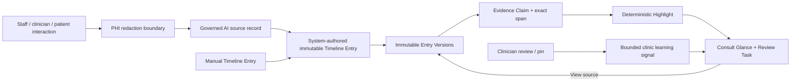
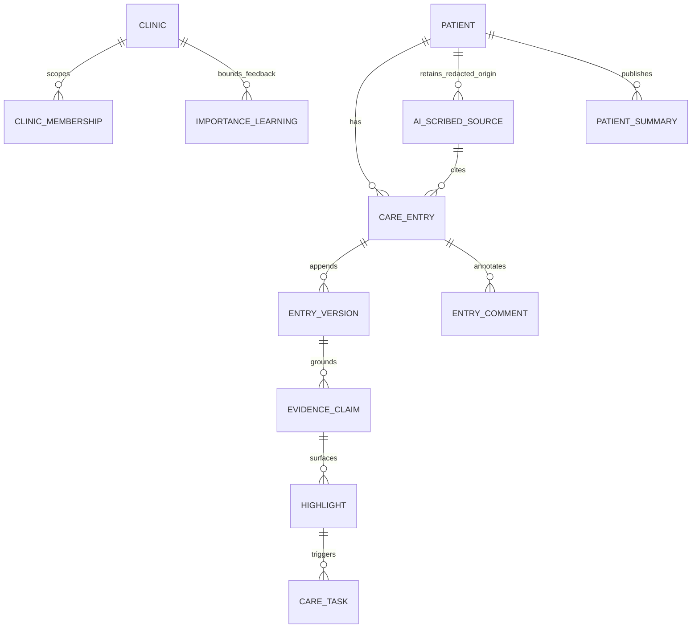

# Nightingale Care Note — Pilot technical brief

## Decision: a shared record, not an opaque AI layer

Nightingale is a clinic-scoped collaboration layer beside the EHR. Its job is
to make the changing story, responsibility, and source of each signal visible
in one consult-ready view. The EHR remains the system of record. The key design
choice is that a Highlight is not a diagnosis, a risk score, or model
confidence: it is a reviewable reading-order signal backed by an immutable
source span and a stated deterministic reason.



## Runtime and security boundary

The Pilot is a Next.js 16 application backed by PostgreSQL. Auth0 verifies the
browser identity. The service validates the issuer, audience, signature and
expiry of the access token before opening a transaction. PostgreSQL maps the
verified subject to a separately provisioned user and uses `SET LOCAL` plus
Clinic Membership Row-Level Security (RLS) for every request. Authentication
never itself creates clinic access.

The browser uses only the restricted `nightingale_web` role. Direct table
mutation is revoked; security-definer procedures implement append-version,
comment, review, task, revert, AI-intake and patient-summary actions. Every
write appends an audit event without clinical content and an outbox event in
the same transaction. An optimistic version check produces deterministic
conflict handling: an outdated edit receives `409 VERSION_CONFLICT`, and a
revert appends a new version instead of overwriting history.



Roles are enforced server-side. Staff can make staff entries and collaborate,
but cannot write clinician content; clinicians can make clinician entries,
review Highlights and publish patient-facing summaries; admins have
clinic-scoped oversight. A separately provisioned patient account receives
only `patient_summaries`. It cannot receive the internal timeline, comments,
tasks, claims, Highlights or raw AI drafts.

## Trust, AI intake and prioritisation

Three explicitly typed system entries are supported: doctor–patient consult,
nurse–patient consult and AI–patient session summaries. Before intake, common
direct identifiers—including email-shaped identifiers, phone-like numbers and
long ID-like numbers—are redacted. The server stores the redacted source and
links the system entry to `ai-source:<id>`; it does not present a fabricated
confidence value. The current local submission mode creates a clearly marked
“AI-scribed draft — clinician review required” from redacted synthetic input.
An external transcription/LLM provider is intentionally not enabled by
default: no real patient audio or text is sent to any provider without a
separate approved processor, agreement, credentials and redaction regression
test corpus.

Claims identify an immutable `entry_version` and `[start,end)` span. Clicking
**View source in Timeline** scrolls to that Entry and highlights the exact
span; the Evidence Workbench also shows the excerpt, evidence state, extractor
version and rule version. This keeps paraphrase separate from its source.

Risk floors are deterministic rules over validated claims. Importance only
changes ordering. Clinician accept or pin can increment a clinic-local,
entity-type feedback value by one, capped at ten; it never changes a risk rule,
clinical content, record visibility or patient summary. Reject and dismiss do
not inflate it. That gives the “learning” feature a measurable, bounded effect
rather than a drifting model ordinal.

## Performance, scope and verification

The Consult Glance read model is indexed by clinic, patient, status and
importance. On this local Postgres instance, `npm run pilot:benchmark` creates
an isolated synthetic fixture with 1,000 Timeline Entries, 20 active
Highlights and 10 open tasks, warms the RLS-scoped read path, then executes
100 requests. Latest result: **P50 11.1 ms, P95 13.7 ms**, below the 300 ms
target. This is a repository/read-model measurement; it deliberately excludes
the Auth0 network exchange and browser rendering, which would be measured in a
production deployment.

Automated checks cover OIDC request verification, tenant isolation and blocked
direct mutation, role-specific entry writes, version increments, stale-write
conflicts, immutable reverts, comments and resolve state, exact Highlight
provenance, clinician-only review, patient-summary isolation, deterministic
risk rules and the benchmark. Run:

```bash
npm run test:pilot-auth
npm run test:pilot-memberships
npm run test:pilot-isolation
npm run test:pilot-workflow
npm run test:pilot-rules
npm run pilot:benchmark
```

This is a synthetic-data Pilot, not a production clinical system. Local Docker
Postgres is not claimed as encrypted-at-rest production storage, and the local
voice capture intentionally records only in-browser synthetic test audio—it
does not transmit or transcribe it. Production readiness requires managed TLS,
managed encryption at rest, formal key management, an approved PHI processor,
operational monitoring, a redaction corpus and a clinical safety review.
