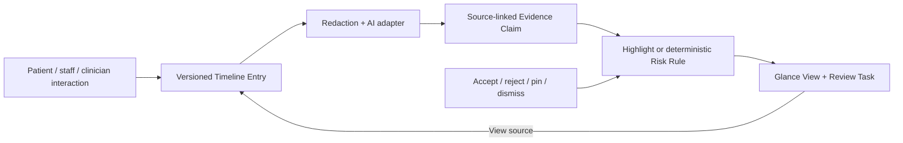
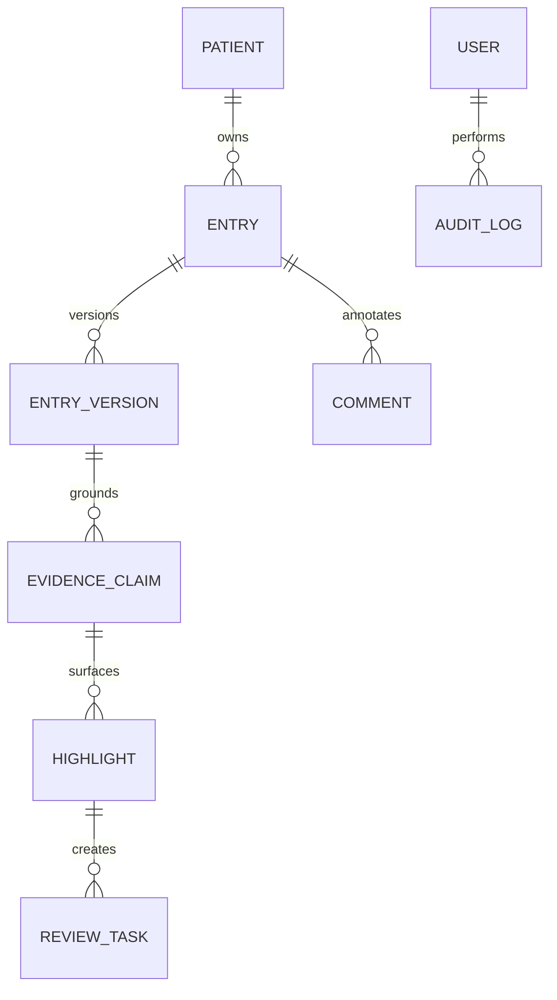

# Nightingale Care Note
## A trust-first longitudinal collaboration layer for clinic teams

### Problem and product thesis

EHRs store structured snapshots well, but the explanatory patient story is fragmented across free-text records. A clinician preparing for a consult has to reconstruct what changed, what is still open, and whether an AI or patient statement can be trusted. Nightingale Care Note is a clinic-scoped longitudinal layer—not a replacement EHR—that turns this into a shared, inspectable workflow.

The product thesis is that AI earns trust through traceability and correction, not by presenting an unexplained confidence score. The default view is a compact Glance View of risks, changes, and open actions; the Timeline remains the source of truth.

### Trust contract

An AI-scribed note is always a system-authored Timeline Entry with a session provenance pointer. AI extraction creates atomic Evidence Claims referencing an immutable `entry_version + span`; summaries are a reading layer, never the sole evidence layer. The system does not display self-reported model confidence. Instead, every claim has an Evidence State: `unverified`, `source-linked`, `clinician-confirmed`, or `conflicted`.

Risk is also deliberately narrow. A Risk Flag is emitted only by a deterministic rule: allergy–medication conflict, configured red-flag symptom, unresolved urgent item, or overdue high-priority follow-up. Its consequence is an unassigned, cancellable Review Task marked “review required—not a diagnosis.” A clinician can dismiss the flag with a required structured reason; this supplies a concrete false-positive review loop. A clinician may also create or confirm a current Clinical Plan; it takes precedence over conflicting older claims while retaining source history.

Importance is separate from risk. It ranks the Glance View using recency, open tasks, clinician confirmation, and clinic-shared feedback. Accept, reject, pin, and dismiss-with-reason interactions affect only this reading-order signal. They cannot alter risk rules, clinical content, patient-facing summaries, or permissions.

### Architecture and data model

The self-contained MVP uses Next.js, TypeScript, SQLite, and Drizzle. The database is the source of truth and server-side route handlers enforce role and clinic scope. Production would move the same logical schema to Postgres with row-level security for defense in depth.

`EntryVersion` is immutable. Editing creates a new version, and reverting creates another new version containing historic content. A Highlight always references the exact version from which it was derived; it is never silently repointed when a source changes. Concurrent edits use optimistic concurrency: different role-owned sections can change independently, while an outdated write to the same section returns a deterministic `409 VERSION_CONFLICT`.

The LLM integration is adapter-based. With an API key it can receive only a Redacted Prompt and return schema-validated Evidence Claims. Without one, seeded AI-scribed notes and deterministic fixtures preserve the entire demo and test path. Names, ID-like strings, and phone numbers are redacted before the LLM boundary; an internal mapping resolves output spans back to original sources. The prototype is synthetic-data-only. TLS, managed encryption at rest, and full key management are explicit production deployment requirements rather than claims made for the local demo.

### Access control and longitudinal scale

Patient, Staff, Clinician, and Admin identities are seeded as HTTP-only server sessions. The Patient response contains only patient-facing entries; it does not return raw AI records, internal comments, tasks, or Highlights. Staff cannot overwrite clinician content, and clinicians cannot overwrite staff content. This is checked on mutation routes, not merely in the browser.

For long records, source entries are never deleted. Items older than 90 days with no risk, open task, or clinician confirmation may be collapsed into Monthly Capsules, with every underlying source still available. The Glance query reads indexed active highlights and open tasks rather than repeatedly reprocessing the full Timeline. The measurement protocol is 100 warm authenticated requests against 1,000 Timeline Entries, 20 active Highlights, and 10 open tasks; the target is P95 ≤ 300ms.

### Scope and validation

The build deliberately prioritizes a trustworthy shared record over a full EHR, ambient transcription, or autonomous clinical decision-making. Its demo follows one synthetic longitudinal case: a patient reports rash after amoxicillin in an AI session; a nurse summary and an overdue lab task add context; staff requests review; a clinician confirms the signal and updates the plan. The review flows from Glance card to exact timeline source, showing why the system surfaced the item and what happens next.

Automated black-box pytest tests validate server-side RBAC, version increment and revert behavior, provenance resolution to an Entry/span, and deterministic concurrent-edit handling. This is intentional: the required `test_*.py` files test the running Next.js HTTP API, not a detached reimplementation of application logic.
